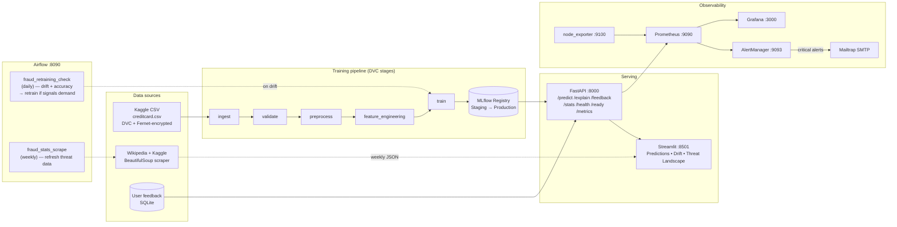

# Credit Card Fraud Detection — End-to-End MLOps

A production-style fraud-detection pipeline: XGBoost classifier behind a FastAPI service, with closed-loop retraining triggered by data drift, full observability, and a single-command path from local dev to a Docker Swarm deployment with replicated API behind a routing-mesh load balancer.

> **Evaluators / graders** — every rubric line is mapped to evidence in
> [`evaluation_docs/`](evaluation_docs/) (architecture diagram, HLD, LLD, test
> plan + report, user manual). Start from
> [`evaluation_docs/00_INDEX.md`](evaluation_docs/00_INDEX.md).

## Problem

Credit card fraud is a low-volume, high-impact classification problem — only ~0.17% of transactions are fraudulent in the canonical Kaggle dataset, and a missed fraud is far more expensive than a false alarm. This project builds the *system around* such a model: ingestion, training, registry-backed serving, monitoring, drift detection, retraining, and deployment.

## Headline metrics

| Metric | Target | Actual (latest run) |
|---|---|---|
| **PR-AUC** (chosen over ROC-AUC due to 1:577 imbalance) | > 0.80 | 0.817 |
| **F1-score** | > 0.75 | 0.811 |
| Recall on fraud class | > 0.70 | 0.768 |
| Inference latency p99 | < 200 ms | ~7 ms |

Full metrics persisted at [models/metrics.json](models/metrics.json), tracked across runs in MLflow at http://localhost:5000.

## Architecture



### Replication and load balancing

In Swarm mode, the `api` service runs as **3 replicas** behind Swarm's routing mesh. All other services run as singletons (mlflow/airflow have SQLite backends; multi-replica would corrupt them). See [docs/phase_17_swarm.md](docs/phase_17_swarm.md).

```
                 ┌───→ api.1 ┐
   curl :8000 ───┼───→ api.2 ┼─── one routing mesh, round-robin
                 └───→ api.3 ┘
```

## Dataset

- **Source**: Kaggle [Credit Card Fraud Detection](https://www.kaggle.com/datasets/mlg-ulb/creditcardfraud) — European cardholders, September 2013, 284,807 transactions.
- **Schema**: `Time` (dropped), `V1`–`V28` (PCA-transformed for confidentiality), `Amount` (StandardScaler), `Class` (0 = legit, 1 = fraud).
- **Caveats**:
  - Extreme class imbalance (~0.172% fraud) — PR-AUC is the headline metric, not ROC-AUC.
  - PCA features mean explainability is structural (SHAP value rankings), not semantic.
  - Single region / single time window — the trained model would not generalize to other markets without retraining.
- **Storage**: Raw CSV is encrypted at rest with Fernet (`creditcard.csv.enc`) and tracked via DVC.

## Tech stack

| Layer | Tool | Purpose |
|---|---|---|
| Version control | Git + DVC | Code + data/model versioning |
| Data validation | Custom (pandas) | Schema/missing/duplicates checks at ingestion |
| Feature store | JSON baseline file with provenance metadata | Drift reference distributions |
| Training | XGBoost 2.0, scikit-learn 1.4 | Classifier + scaler |
| Experiment tracking | MLflow 2.10 | Runs, params, metrics, artifacts |
| Model Registry | MLflow Registry | Staging → Production lifecycle |
| Serving | FastAPI 0.109 + Uvicorn | Predict, explain, feedback endpoints |
| Explainability | SHAP 0.44 | `/explain` endpoint top-k features |
| Dashboard | Streamlit 1.56 | Predictions, drift, threat landscape |
| Web scraping | BeautifulSoup 4.12 + lxml | Public fraud-stats ingestion |
| Container | Docker + Compose | Local 8-service stack |
| Orchestration | Docker Swarm | Replicated deployment with routing mesh |
| Secrets | Docker secrets (file-sourced) | Mailtrap / Airflow / Grafana creds |
| Scheduling | Apache Airflow 2.10 | Drift-triggered retraining + weekly scrape |
| Metrics | Prometheus + node_exporter | API + host telemetry |
| Dashboards | Grafana (provisioned) | API health, host CPU/RAM/disk |
| Alerting | AlertManager + Mailtrap SMTP | Critical drift / latency alerts |
| CI | GitHub Actions | Lint, test (62% coverage), build, compose+swarm validation |
| Security | Fernet encryption | Raw data at rest |

## Project structure

```
credit-card-fraud-detection/
├── .github/workflows/ci.yml      # 4-job CI: lint → test → build → validate-compose
├── airflow/dags/                  # fraud_retraining_check, fraud_stats_scrape
├── configs/                       # YAML config files for the pipeline
├── data/
│   ├── raw/                       # creditcard.csv (DVC-tracked + Fernet-encrypted)
│   ├── processed/                 # X_train, X_test, scaler.joblib
│   ├── baselines/                 # feature_baselines.json (with provenance metadata)
│   └── external/                  # scraped fraud_stats.json (gitignored, ephemeral)
├── docker/
│   ├── airflow.Dockerfile         # Airflow image with UID 1000 remap
│   └── monitoring/                # Prometheus, AlertManager, Grafana provisioning
├── docs/                          # phase_1_*.md … phase_19_*.md, EDA plots
├── mlruns/                        # MLflow tracking + artifacts (gitignored)
├── models/                        # best_model.joblib, feature_names.json
├── notebooks/                     # eda.ipynb (Phase 5)
├── scripts/                       # run_*.py wrappers + swarm_up/down/verify
├── secrets.example/               # placeholder secret files (committed)
├── secrets/                       # real secrets (gitignored)
├── src/
│   ├── api/                       # FastAPI app
│   ├── app/                       # Streamlit dashboard
│   ├── data/                      # ingest, preprocess, validate, scraper, security, database
│   ├── features/                  # engineer_features (versioned)
│   ├── models/                    # train, evaluate, registry helpers
│   └── monitoring/                # drift_detection
├── tests/
│   ├── unit/         (47 tests)   # hermetic, fast
│   ├── integration/  (12 tests)   # FastAPI TestClient (in-process)
│   └── e2e/           (2 tests)   # full pipeline; needs DVC data + registry
├── docker-compose.yml             # base stack (compose mode = single replica each)
├── docker-compose.swarm.yml       # Swarm overlay: api replicas=3 + restart_policy
├── Dockerfile                     # api / streamlit base image
├── requirements.txt
└── README.md
```

## Quick start

### One-time setup

```bash
# 1. Python deps (use a venv)
pip install -r requirements.txt

# 2. Get the dataset
#    (a) Download from Kaggle → data/raw/creditcard.csv, OR
#    (b) DVC pull from your remote
dvc pull

# 3. Seed placeholder secrets (replace with real values for Mailtrap to work)
mkdir -p secrets && cp secrets.example/airflow_admin_password \
                       secrets.example/grafana_admin_password \
                       secrets.example/mailtrap_smtp_password secrets/
```

### Train and evaluate

```bash
dvc repro               # validate → preprocess → feature_engineering → train → evaluate
```

Each stage can also be run individually via `python scripts/run_<stage>.py`.

### Run the stack — Compose mode (dev)

```bash
docker compose up -d
```

| Service | URL | Login |
|---|---|---|
| FastAPI       | http://localhost:8000  | none (open) |
| Swagger docs  | http://localhost:8000/docs | none |
| Streamlit     | http://localhost:8501  | none |
| MLflow        | http://localhost:5000  | none |
| Airflow       | http://localhost:8090  | admin / `secrets/airflow_admin_password` |
| Prometheus    | http://localhost:9090  | none |
| Grafana       | http://localhost:3000  | admin / `secrets/grafana_admin_password` |
| AlertManager  | http://localhost:9093  | none |

### Run the stack — Swarm mode (replicated)

```bash
./scripts/swarm_up.sh              # init swarm + deploy stack with 3 api replicas
./scripts/verify_load_balancing.sh # 30 requests, distribution across replicas
./scripts/swarm_down.sh fraud --leave-swarm
```

See [docs/phase_17_swarm.md](docs/phase_17_swarm.md) for full Swarm details.

## API surface

| Endpoint | Method | Purpose |
|---|---|---|
| `/health`   | GET  | Liveness — process is up |
| `/ready`    | GET  | Readiness — model is loaded from registry |
| `/predict`  | POST | Score a transaction `{features: [...], transaction_id}` |
| `/explain`  | GET  | Top-k SHAP contributions for a previous transaction |
| `/feedback` | POST | Record actual label for a previous transaction |
| `/stats`    | GET  | Aggregate prediction stats from the SQLite store |
| `/metrics`  | GET  | Prometheus-format metrics (scraped every 15s) |

Examples:

```bash
# Predict
curl -X POST http://localhost:8000/predict \
  -H "Content-Type: application/json" \
  -d '{"features": [0.1, -1.2, ...], "transaction_id": "txn_001"}'

# Explain (after a predict)
curl "http://localhost:8000/explain?transaction_id=txn_001&top_k=5"

# Submit ground-truth feedback
curl -X POST http://localhost:8000/feedback \
  -H "Content-Type: application/json" \
  -d '{"transaction_id": "txn_001", "actual_label": 1}'
```

## Tests + CI

```bash
pytest tests/unit/ tests/integration/ --cov=src    # 58 tests, 62% coverage
```

GitHub Actions runs the same on push/PR to `main`/`develop`:

- **lint** — `flake8` + `black --check`
- **test** — full pytest with coverage report (uploaded as artifact)
- **build** — `fraud-api` and `fraud-airflow` images
- **validate-compose** — base `docker compose config` + Swarm overlay via `docker stack config`

E2E tests (`tests/e2e/`) require DVC data + a registry-loaded model — run locally only.

## Closed-loop retraining

The `fraud_retraining_check` Airflow DAG runs daily ([airflow/dags/fraud_retraining_dag.py](airflow/dags/fraud_retraining_dag.py)):

1. **`check_drift`** — KS-test across V1-V28 + engineered features against the baseline distribution in `data/baselines/feature_baselines.json`.
2. **`check_accuracy`** — recent feedback labels vs. predictions in the SQLite store.
3. **`decide_retrain`** — `BranchPythonOperator`. Drift detected OR accuracy degraded → retrain branch; else skip.
4. **`retrain`** — full training pipeline; logs to MLflow; auto-promotes to Staging if metrics regression-tested OK.

A second DAG (`fraud_stats_scrape`, weekly) refreshes the Streamlit "Threat Landscape" panel.

## Operational modes

| Concern | Compose | Swarm |
|---|---|---|
| Replicas | 1 of each | 3× api, 1× others |
| Load balancing | n/a | Built-in routing mesh on published ports |
| Secrets | bind-mounted from `./secrets/` | Stored encrypted in Raft log, mounted at `/run/secrets/` |
| Service ordering | `depends_on` (best-effort) | Restart policy + healthchecks |
| Best for | Local dev, debugging | Demonstrating production patterns |

Both share **the same `docker-compose.yml`**; Swarm overlays via `docker-compose.swarm.yml`. No separate dev/prod fork.

## Reproducibility

Every model in the registry can be traced back to:

- **Git commit** — exact source code (`git show <hash>`)
- **DVC lock** — exact data version (`dvc.lock`)
- **MLflow run** — hyperparameters, metrics, artifacts, environment
- **Feature baseline JSON** — `_meta` block with `source_data_md5`, `feature_version`, `computed_at`

Mismatch detection: drift-detection refuses to compare predictions against a baseline whose `feature_version` differs from the runtime `engineer_features` version.

## Security posture

- Raw CSV encrypted at rest (Fernet).
- Mailtrap SMTP credentials, Grafana admin, Airflow admin passwords moved out of code into Docker secrets ([docs/phase_17_swarm.md](docs/phase_17_swarm.md)).
- API has no authentication (out of scope for an academic project; would be added behind a reverse proxy or API gateway in production).

## Development phases

This repo was built incrementally; each phase has a doc in [docs/](docs/) explaining the rationale and tradeoffs:

| # | Phase | Tag | Doc |
|---|---|---|---|
| 1 | Problem definition + metrics | `v0.1.0-phase1` | [phase_1_*.md](docs/) |
| 2 | Git workflow (branches, conventional commits, tags) | `v0.2.0-phase2` | [phase_2_*.md](docs/) |
| 3 | Streamlit pyarrow ImportError fix | `v0.3.0-phase3` | [phase_3_*.md](docs/) |
| 4 | Data ingestion + validation + DVC | `v0.4.0-phase4` | [phase_4_*.md](docs/) |
| 5 | EDA + drift baselines with provenance | `v0.5.0-phase5` | [phase_5_eda_baselines.md](docs/phase_5_eda_baselines.md) |
| 6 | BeautifulSoup multi-source scraper | `v0.6.0-phase6` | [phase_6_scraper.md](docs/phase_6_scraper.md) |
| 7 | Preprocessing — eliminated scaler leakage | `v0.7.0-phase7` | [phase_7_*.md](docs/) |
| 8 | Training de-dup + quantization + experiment sweep | `v0.8.0-phase8` | [phase_8_*.md](docs/) |
| 9 | MLflow Registry lifecycle + API loads from registry | `v0.9.0-phase9` | [phase_9_*.md](docs/) |
| 10 | `/explain` endpoint + full API verification | `v0.10.0-phase10` | [phase_10_*.md](docs/) |
| 11 | docker-compose split into 5 services | `v0.11.0-phase11` | [phase_11_*.md](docs/) |
| 12 | node_exporter for host metrics | `v0.12.0-phase12` | [phase_12_*.md](docs/) |
| 13 | Provisioned Grafana dashboards | `v0.13.0-phase13` | [phase_13_*.md](docs/) |
| 14 | AlertManager + Mailtrap SMTP | `v0.14.0-phase14` | [phase_14_*.md](docs/) |
| 15 | Closed-loop drift + feedback + retraining | `v0.15.0-phase15` | [phase_15_*.md](docs/) |
| 16 | Airflow DAGs for retraining + scraping | `v0.16.0-phase16` | [phase_16_airflow.md](docs/phase_16_airflow.md) |
| 17 | Docker Swarm + secrets management | `v0.17.0-phase17` | [phase_17_swarm.md](docs/phase_17_swarm.md) |
| 18 | CI alignment + coverage + Swarm validation | `v0.18.0-phase18` | [phase_18_ci.md](docs/phase_18_ci.md) |
| 19 | README + architecture diagram (this) | `v0.19.0-phase19` | [phase_19_docs.md](docs/phase_19_docs.md) |

## License

Educational project — see repository for any explicit license. Dataset is © Worldline / ULB and bound by the Kaggle terms of use.
