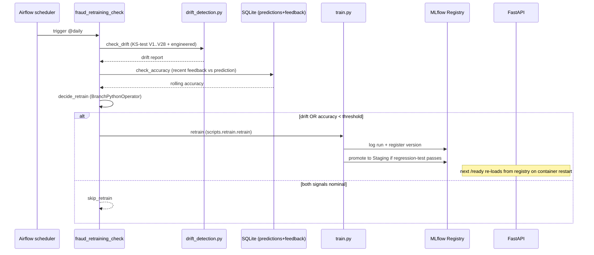

# Architecture Diagram & Block-Level Explanation

> **Rubric line** — "An architecture diagram with an explanation of the blocks."

This document presents the system architecture as a layered diagram and
explains every block: *what it does*, *why it is there*, *what it talks to*,
*how it is wired*, and *what would change if it failed*.

---

## 1. Static figures

Three figures are provided. They are rendered as Mermaid (text-as-diagram, so
they can be diff'd in PRs) **and** as `.png` exports kept under
[`figures/`](figures/) for inclusion in slides / reports.

| Figure | Purpose | Files |
|---|---|---|
| **Fig. 1** — System architecture (8 services) | The "what runs where" view. | [`figures/fig_1_architecture.png`](figures/fig_1_architecture.png), inline Mermaid below |
| **Fig. 2** — DVC training pipeline DAG | The "how a model gets built" view. | [`figures/fig_2_dvc_pipeline.png`](figures/fig_2_dvc_pipeline.png), inline Mermaid below |
| **Fig. 3** — Closed-loop retraining sequence | The "how the system heals itself" view. | [`figures/fig_3_retraining_sequence.png`](figures/fig_3_retraining_sequence.png), inline Mermaid below |

---

## 2. Fig. 1 — System architecture

```mermaid
flowchart LR
  subgraph "External / Sources"
    KAGGLE[Kaggle CSV<br/>creditcard.csv<br/>Fernet-encrypted]
    WEB[Wikipedia + Kaggle pages<br/>BeautifulSoup scraper]
    USER[End user / browser]
  end

  subgraph "Frontend (port 8501)"
    ST[Streamlit Dashboard<br/>Predict / Batch / Feedback / Drift / Threats / About]
  end

  subgraph "Backend (port 8000)"
    API[FastAPI<br/>/predict /explain /feedback<br/>/stats /health /ready /metrics]
    SQL[(SQLite<br/>predictions, feedback,<br/>drift_reports)]
  end

  subgraph "Model lifecycle (port 5000)"
    ML[MLflow Tracking +<br/>Model Registry]
    REG[(Staging / Production<br/>aliases)]
    ART[(Run artifacts:<br/>model, params,<br/>metrics, env)]
  end

  subgraph "Orchestration (port 8090)"
    AF[Airflow standalone<br/>scheduler + webserver]
    DAG1[fraud_retraining_check<br/>@daily]
    DAG2[fraud_stats_scrape<br/>@weekly]
  end

  subgraph "Observability"
    PROM[Prometheus :9090]
    NE[node_exporter :9100<br/>host CPU/RAM/disk]
    GRA[Grafana :3000<br/>API + Host dashboards]
    AM[AlertManager :9093]
    SMTP[Mailtrap SMTP<br/>3rd-party sandbox]
  end

  subgraph "Storage (host filesystem)"
    DVC[DVC cache<br/>data/raw/, processed/]
    BASE[(feature_baselines.json<br/>+ provenance _meta)]
    SCRAPED[(fraud_stats.json)]
    SECRETS[Docker Secrets<br/>SMTP / admin passwords]
  end

  USER -->|browser| ST
  ST -->|HTTP REST| API
  API --> ML
  ML --> REG
  ML --> ART
  KAGGLE -.->|dvc pull| DVC
  DVC --> API
  BASE --> API
  WEB -.->|weekly DAG| SCRAPED
  SCRAPED --> ST
  API --> SQL
  API -->|/metrics scrape| PROM
  NE -->|host metrics| PROM
  PROM --> GRA
  PROM --> AM
  AM -->|critical alerts| SMTP
  AF --> DAG1
  AF --> DAG2
  DAG1 -->|on drift / decay| ML
  DAG1 --> SQL
  DAG2 -->|refreshes| SCRAPED
  SECRETS -.->|/run/secrets/| AF
  SECRETS -.->|/run/secrets/| GRA
  SECRETS -.->|/run/secrets/| AM
```

### 2.1 Block-level explanation

| # | Block | Tech | What it does | Why this choice | Failure mode |
|---|---|---|---|---|---|
| 1 | **Streamlit Dashboard** | Streamlit 1.56 | Six-page UI: single predict / batch predict / feedback / dashboard / threat landscape / about. Talks to API via REST only — **no shared Python objects**, so frontend and backend can deploy independently. | Streamlit gives the fastest path from a Pandas-first ML codebase to a usable UI without writing JS. | If Streamlit dies, API + monitoring continue to work; only the visual layer is gone. |
| 2 | **FastAPI service** | FastAPI 0.109 + Uvicorn | Real-time prediction (`/predict`), explanation (`/explain` SHAP), feedback ingestion (`/feedback`), aggregate stats (`/stats`), Prometheus exposition (`/metrics`), liveness (`/health`) and readiness (`/ready`). Loads model from MLflow Registry at startup with local-file fallback. | REST listed in rubric; FastAPI gives Pydantic validation + auto OpenAPI / Swagger UI for free. | If model load fails, `/health` stays 200 (process up) but `/ready` returns 503 (no traffic served). |
| 3 | **SQLite (per-API-pod)** | SQLite 3 | Persists every prediction (id, prediction, prob, latency, feature vector JSON), every piece of feedback, and historical drift reports. | Single binary on disk → no extra service to operate; `WAL` mode = safe-enough concurrent writes. Easy to snapshot. | If file is lost, the feedback loop loses history but the stateless `/predict` endpoint keeps working. |
| 4 | **MLflow** | MLflow 2.10 | (a) Tracking server: receives runs from training. (b) Model Registry: holds versions + Staging/Production aliases. | Single tool covers both functions in the rubric (experiment tracking *and* model registry). File-store backend keeps the demo cloud-free. | If MLflow is down at API startup, API falls back to `models/best_model.joblib`; new training fails until restored. |
| 5 | **Apache Airflow** | Airflow 2.10 (Sequential executor) | Hosts two DAGs — daily retraining decision and weekly fraud-stats scrape. Visualises both pipelines as task graphs in its UI. | The rubric requires "Airflow / Spark / Ray / custom" for data engineering; Airflow's UI doubles as the **pipeline management console** required by the demo rubric. | If Airflow is down, scheduled retraining stops; manual `python scripts/retrain.py` still works. |
| 6 | **Prometheus** | Prometheus latest | Pulls `/metrics` from API every 15s and from `node_exporter` for host stats. Evaluates alert rules. | Industry standard, listed in rubric. Pull model means broken targets surface as `up==0` rather than silently. | If Prometheus dies, dashboards stop updating; the API is unaffected. |
| 7 | **node_exporter** | prom/node-exporter | Exposes host CPU / RAM / disk / network on `:9100`. | Required so we instrument *the whole software*, not just the API. Reads `/proc`, `/sys`, `/` from the host via read-only bind mounts. | Loss only affects host-level dashboards. |
| 8 | **Grafana** | Grafana latest | Renders pre-provisioned API + Host dashboards; admin login from Docker Secret. | Listed in rubric; provisioning means it works on the very first `docker compose up`. | Loss = no visualisation, but Prometheus retains metrics. |
| 9 | **AlertManager** | prom/alertmanager | Receives alerts from Prometheus; routes critical ones to Mailtrap SMTP. | Decouples *deciding to alert* (Prometheus) from *delivering an alert* (AlertManager) — the conventional Prometheus stack pattern. | Loss = alerts no longer delivered; Prometheus continues to evaluate them. |
| 10 | **Mailtrap SMTP** | 3rd-party sandbox | Captures alert emails for inspection without spamming real inboxes. | Avoids real SMTP setup while still demonstrating the alert path end-to-end. | Loss = alerts buffered in AlertManager; no data loss. |
| 11 | **DVC cache** | DVC 3.x | Versions the encrypted raw CSV + intermediate processed datasets. `dvc.lock` pins exact data hashes. | Listed in rubric; together with Git gives data + code versioning. | Loss = `dvc pull` from remote restores; no production-traffic impact. |
| 12 | **Feature baselines** | JSON file | Per-feature min/max/mean/std/quartiles + `_meta` block (`source_data_md5`, `feature_version`, `computed_at`). | Drift detector compares live data against this; provenance metadata makes mismatches loud. | Loss = drift detection skips; alerting reflects the gap. |
| 13 | **Scraped fraud stats** | JSON file | Streamlit "Threat Landscape" page reads from this. Refreshed by weekly DAG. | Demonstrates BeautifulSoup data acquisition (rubric II.A). Decoupled from training data. | Loss = Threat Landscape page shows a friendly "no data yet" message. |
| 14 | **Docker Secrets** | Compose & Swarm | SMTP password, Airflow admin password, Grafana admin password — never in env vars or Git. | Same compose file works in `docker compose` (file-mounted) and `docker stack deploy` (Raft-encrypted). | Missing file → service refuses to start; explicit failure better than silent default. |

### 2.2 Network topology

- All services share the `fraud-net` network — `bridge` driver under
  `docker compose`, `overlay` driver under `docker stack deploy` (Swarm).
- The frontend↔backend boundary is **only** the REST contract on
  `http://api:8000`. Streamlit imports nothing from the API package; this is
  the loose-coupling rule from the rubric (Software Engineering → Design
  Principle).
- Only six host ports are exposed: `8000` (API), `8501` (Streamlit), `5000`
  (MLflow), `8090` (Airflow → 8080 inside), `3000` (Grafana), `9090`
  (Prometheus), `9093` (AlertManager), `9100` (node_exporter). All
  inter-service traffic stays on the Docker network.

### 2.3 Replication / load balancing (Swarm mode)

```
                 ┌───→ api.1 ┐
   curl :8000 ───┼───→ api.2 ┼─── round-robin (Swarm routing mesh)
                 └───→ api.3 ┘
```

`docker-compose.swarm.yml` overlays `replicas: 3` for the `api` service plus
a `restart_policy` and a `update_config: failure_action=rollback`. Every other
service stays single-replica because their state stores (MLflow file backend,
Airflow SQLite, AlertManager Raft, Prometheus TSDB) cannot be safely sharded.
[`scripts/verify_load_balancing.sh`](../scripts/verify_load_balancing.sh)
fires 30 requests at the published port and prints the per-replica
distribution as evidence.

---

## 3. Fig. 2 — DVC training pipeline DAG

```mermaid
flowchart LR
  RAW["data/raw/<br/>creditcard.csv (encrypted)"] --> VAL[validate<br/>scripts/run_validate.py]
  VAL -->|validation_report.json| PRE[preprocess<br/>scripts/run_preprocessing.py]
  PRE -->|X_train, X_test,<br/>y_train, y_test, scaler.joblib| FE[feature_engineering<br/>scripts/run_feature_engineering.py]
  FE -->|feature_baselines.json| TR[train<br/>scripts/run_training.py]
  TR -->|best_model.joblib<br/>+ metrics.json<br/>+ MLflow run| EV[evaluate<br/>scripts/run_evaluate.py]
  EV -->|reports/eval_metrics.json<br/>confusion_matrix.json<br/>roc_curve.json| DONE([Pipeline complete])
```



### 3.1 Block-level explanation

| Stage | Inputs (DVC `deps`) | Outputs (DVC `outs`) | Why |
|---|---|---|---|
| **validate** | `creditcard.csv`, `src/data/{ingest,validate}.py` | `data/validation_report.json` (uncached) | Schema, missing values, duplicates, label distribution — fail fast on bad ingest. |
| **preprocess** | raw CSV, `src/data/preprocess.py`, `configs/config.yaml` | `X_train.csv`, `X_test.csv`, `y_train.csv`, `y_test.csv`, `scaler.joblib` | Drops `Time`, removes 9,144 duplicates, scales `Amount` (fit-on-train **only** — Phase 7 fixed leakage). |
| **feature_engineering** | `X_train.csv`, `src/features/feature_engineering.py` | `data/baselines/feature_baselines.json` | 5 derived features (V14×V12, log/binned Amount, …) + per-feature drift baselines. |
| **train** | preprocessed splits, `src/models/train.py`, config | `models/best_model.joblib`, `models/feature_names.json`, `models/metrics.json` | XGBoost training; `tree_method=hist` quantization; logs to MLflow + registers to Staging. |
| **evaluate** | trained model, X/y test | `reports/{eval_metrics,confusion_matrix,roc_curve}.json` | DVC plots; metrics independent of train.json so regressions are obvious. |

`dvc repro` walks this DAG, recomputes only what changed, and updates
`dvc.lock` with the new content hashes. Together with `git commit dvc.lock`,
this is what gives the rubric line "every step reproducible".

---

## 4. Fig. 3 — Closed-loop retraining sequence



The same diagram is rendered as
[`figures/fig_3_retraining_sequence.png`](figures/fig_3_retraining_sequence.png).
The decision logic lives in
[`airflow/dags/fraud_retraining_dag.py:84-99`](../airflow/dags/fraud_retraining_dag.py#L84-L99) — drift OR accuracy decay
triggers the retrain branch; otherwise the DAG ends in `skip_retrain` (an
`EmptyOperator`).

---

## 5. Block-by-block dataflow narrative

A grader walking the system end-to-end would see:

1. **Cold start.** `docker compose up -d` brings up 8 services. MLflow comes
   up first (others `depends_on: mlflow`). API's `lifespan` hook then
   contacts MLflow, downloads the joblib artifact for the registered model
   version aliased `production`, and warms the SHAP explainer lazily on
   first `/explain` call.
2. **A live request.** Streamlit POSTs `{features: [...], transaction_id: ...}`
   to `http://api:8000/predict`. API runs `model.predict(...)`, persists the
   record to SQLite, increments the `predictions_total` counter, observes
   the latency histogram, and returns a `PredictionResponse`.
3. **Observation.** Prometheus scrapes `/metrics` 15 s later and stores the
   sample. Grafana panels are pre-provisioned to query Prometheus.
4. **Feedback.** Operator submits ground truth via Streamlit's Feedback
   page → POST `/feedback`. API joins the prediction by `transaction_id`,
   stores the actual label, and updates the `model_real_accuracy` gauge.
5. **Drift loop.** Every 24 h Airflow's `fraud_retraining_check` DAG runs
   the KS-test against `feature_baselines.json` and computes recent
   feedback accuracy. If either tripwire fires, it kicks off retraining,
   logs the run to MLflow, and promotes to Staging when regression-test
   passes. The next API restart picks up the new version.
6. **Alert path.** Sustained `predictions_errors_total > 5%` triggers
   AlertManager → Mailtrap. The alert subject identifies the rule and the
   instance.

This is the loop the rubric describes as "closed-loop monitoring +
retraining". Every link is implemented; no stubs.

---

## 6. Why these specific blocks (and not others)

| If the rubric said… | We chose… | Rejected alternative | Reason |
|---|---|---|---|
| Data engineering — Airflow / Spark / Ray | **Airflow** | Spark | 285 k rows fits easily in pandas; we need orchestration of *retraining*, not big-data joins. |
| Experiment tracking | **MLflow** | Weights & Biases / Neptune | Self-hosted, file-backed, no SaaS account needed → satisfies "no cloud". Same tool covers Registry. |
| Model serving | **FastAPI (REST)** | TorchServe / TF Serving | Tabular XGBoost classifier — neither Torch nor TF nominal. Rubric explicitly lists REST APIs. |
| Containerization | **Docker Compose + Swarm overlay** | Kubernetes | Compose meets the Compose requirement; Swarm overlay demonstrates replication & secrets without a K8s control plane. |
| Drift detection | **KS-test per feature** | PSI / chi-square | Continuous PCA features — KS is parameter-free and well-suited. |
| Front-end framework | **Streamlit** | Plotly Dash / React | Lowest LOC for a Python-first team; rubric only judges UX, not framework. |
| Explainability | **SHAP TreeExplainer** | LIME / feature importances | TreeExplainer is exact + fast on XGBoost; SHAP values are signed, additive — useful in a UI. |

Every alternative is documented in the corresponding [`docs/phase_*.md`](../docs/) file.
